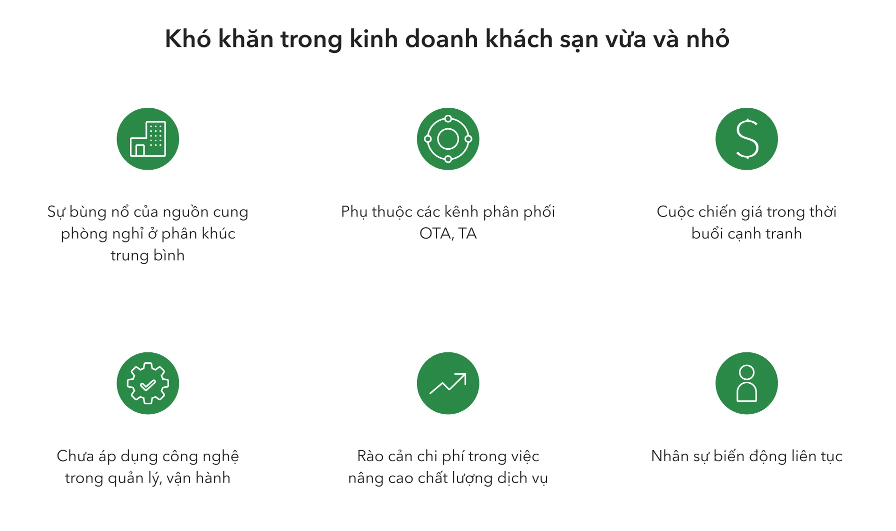
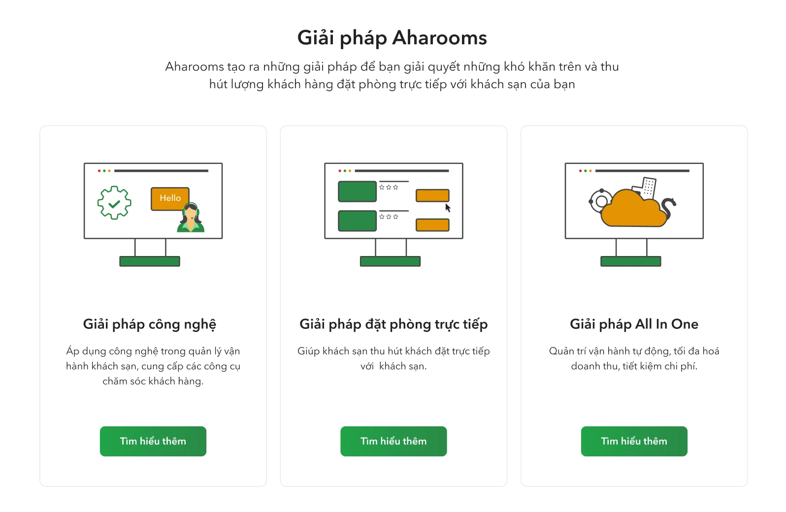
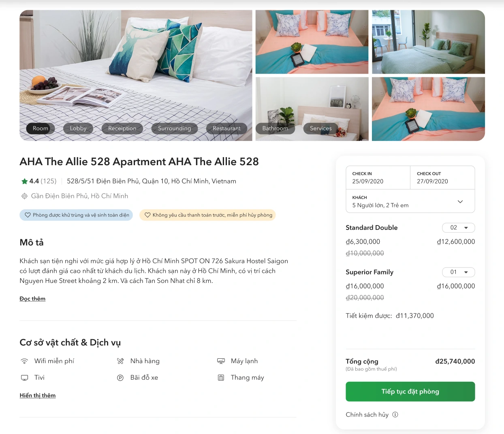
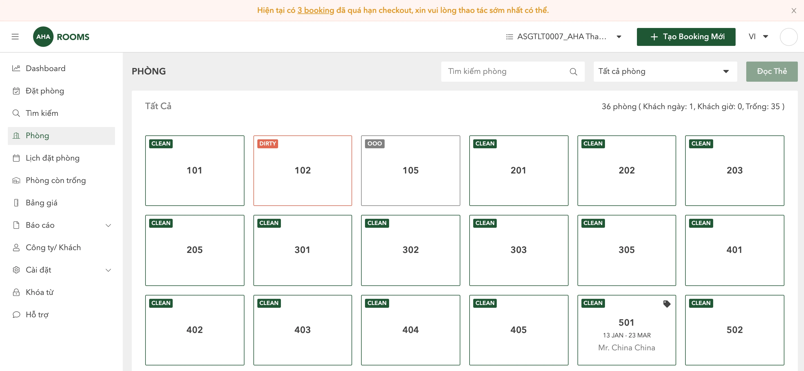
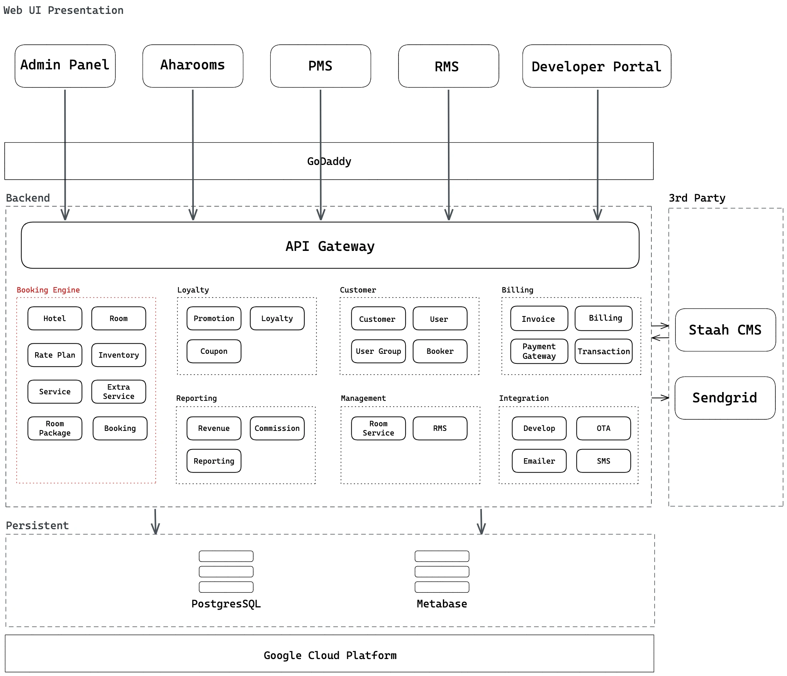
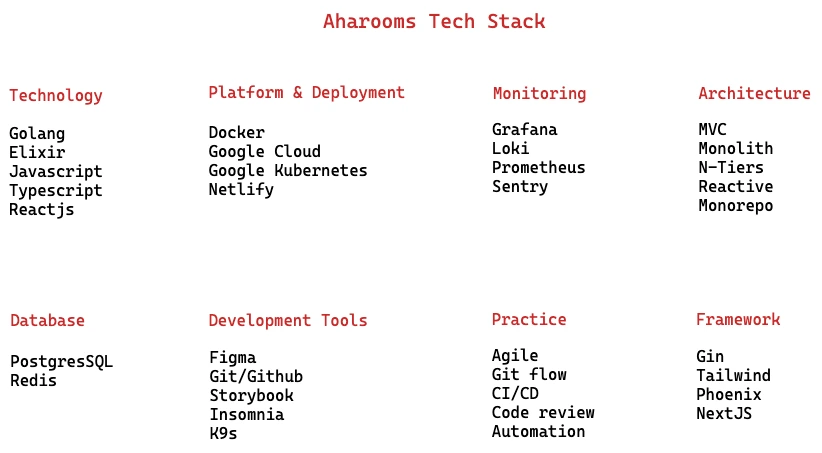
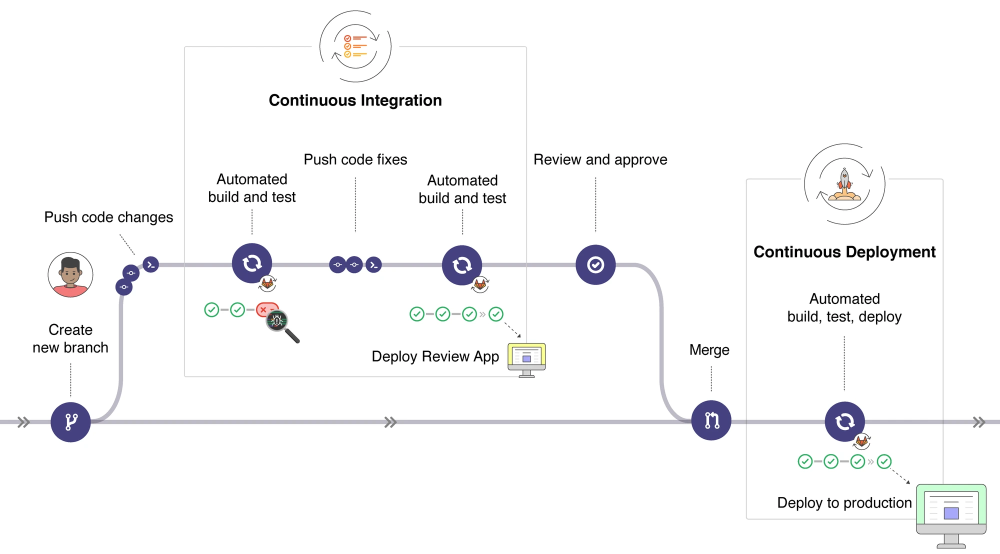

### Challenge

- The affordable hotel segment(2-3 stars) is a potential market but still developing spontaneously, management and operation are running with a lack of uniformity in service standards.
- In addition, the business still running in a traditional way, relying on direct visitors, instead of applying technology in building a platform for operations management, promotion applications, and brand identity ... are also the reasons why many popular hotels are in a situation where room-filling cannot be guaranteed.

> The Covid-19 pandemic has confronted the hospitality industry with an unprecedented challenge.

- When the Covid-19 hit, many industries were affected and tourism and hospitality were the most severely affected. Aharooms team has faced a tough challenge in order to maintain the current business. Services diversity is the only way to find new clients. Any services that could help Aharooms boosting and optimizing revenue for Hotel Owners is a shot they have to take.

### Solution

- Aharooms aims for the goal of optimizing revenue for 2-3 star Hotels with multiple sale channels, property management, and extra services.
- Better understanding and localization are advantages for a Vietnamese product for Vietnamese people.

#### 1. Solution design

Aharooms platform provides a full package of services: From hotel management, booking channel management comes to direct booking, extra services, and customer services with a goal to help business owners solve the problem of room-filling.

**Extranet (Direct booking platform)**

- In order to optimize the Acquisition stage of the funnel. We have built the Extranet platform as a Shopify for Hotel.

  - Direct Booking: Chatbot Integration with Hotel Facebook's Business page, Aharooms will setup end-to-end solutions so that guest could easily books hotel via Hotel Facebook Page.
  - Hourly booking and Nighttime booking: optimizing room-filling of Hotel, customized for the Vietnamese market.
  - Group Booking: optimize the booking volume of Corporate partners, including company trips, business trips...

**Management Systems:** a core value of Aharooms platform when applying technology in building a platform for hotel operations management, budgeting, and promotion applications.

- The Property Management System (PMS): Manages Hotel Inventory, manages the booking via different channels, and with detailed room services management. This is a challenge module that takes Dwarves months to understand the operation process at budget hotels, build up the personas and come up with a Solution that standardizes mostly all the hotel's management and operation process.
- The Revenue Management System (RMS): The budgeting system helps to optimize the rate plan for hotels. With years in the Hospitality domain, Aharooms has great insights into Hotel operations and pricing. RMS provides Aharooms the ability to act as a Business Development division of hoteliers.

**Extra services:** improve the checkin-checkout process, manage 3rd party services.

**Loyalty System:** a Cashback system when users refer their friends to use Aharooms platform for booking. Initial using Ahacoin as a reward within the platform, running concurrently with other promotion programs for increasing Customer Loyalty.

**Production Report**: visualization of overall revenue/guests/room-nights to analyze the business efficiency by time and different categories like seasons, regions, or sales channels. Along with some more detailed reports about the average daily rate, length of stay, and the expenditure of guests by room type levels, it is easier to answer the questions on how to make decisions to optimize the business such as: _which is the peak-seasons do we need to invest more human resources? which segments do we get high occupancy rate? Should we upgrade our rooms to Deluxe type to attract more guests? In which low-peak seasons do we need to reduce spending on SEO campaigns and focus more on walk-in guests?_

**Cancellation report**: an overview of canceled booking across hotels and areas by room types and market segment. It indicates the cancellation trends by factors: room rate, room type, lead time, customer segment, and area. Based on the analysis, strategies can be devised to minimize the number of cancellations and increase the occupancy rate.

#### 2. System design

| System         | Tech Stacks               |
| -------------- | ------------------------- |
| Front-end      | React, NextJS, TypeScript |
| Infrastructure | k8s, AWS, Prometheus      |
| Back-end       | Golang, Elixir            |

#### Architecture

We took over Aharooms's system when it had been in development for almost 2 years. Like every other startup's story, Aharooms's vision was to build an MVP(Minimum Viable Product) product for testing the market in no time causing developers unable to balance new feature development with technical debt. The system then encountered a series of problems with design, architecture, and database. It took a while for us to analyze and find the optimal solution for the problems and reflects the end result in the high-level architecture below:

List of main components

- **Booking Engine**: the core engine powers Aharooms ecosystem for capturing and processing direct online reservations. It's also extensible for 3rd systems to integrate with.
- **Admin Panel**: This is an administrative dashboard for a hotel property. It's used to access and update all the information displayed on [aharooms.com](http://aharooms.com/) property page, including payment options and policies, rooms and rates, photos and descriptions, reviews.
- **PMS**: module that enabled a hotel or group of hotels to manage front-office capabilities, such as booking reservations, guest check-in/check-out, room assignment, managing room rates, and billing.
- **RMS**: module that maximizes hotel room type sales and revenue. The revenue management can be neatly summarized as the following: Selling the right room, to the right customer, at the right time, for the right price, via the right distribution channel, with the best cost efficiency.
- **Developer Portal**: provide Open API for external developers to build tools around the Aharooms ecosystem.
- **Aharooms**: it is the landing page and also the booking site of Aharooms. On Aharooms booking site, customers can browse a list of hotels and also subscribe to other services like hourly or daily booking.
- **PostgresSQL**: it comes along with the whole system. It stores all the data related to operation for the initial version.
- [Metabase](https://www.metabase.com/): a reporting service which helps managers and sale team to monitor their business operations in terms of revenue, number of bookings, ADR... for each hotel and the entire hotel chain as well.
- [Staah CMS](https://www.staah.com/):An Online Hotel Booking System & Hotel Channel Manager. We use Staah to manage hotel inventory distribution in OTA channels.
- [Sendgrid](https://sendgrid.com/): provide API to interact with transactional email. We use SendGrid to sign up & confirmation email.

##### Cloud infrastructure

We deploy our system to Google Cloud and keep them there. The overall Aharooms cloud infra is as below.

- **Docker Container**: we apply the Docker centered workflow. Docker Container for deployment with data isolation & context separation.
- **Kubernetes**: K8s is a modern orchestration tool built by the Google team. Kubernetes orchestrates the docker containers under the service provided by Google Kubernetes Engine.
- **Google Cloud**: Aharooms nodes are placed in the region of Singapore. The GCP gives us freedom and risk-free in a major cloud security issue.
- **Netlify**: For both front-page websites and admin dashboards, we deploy our React.js sites to Netlify. Netlify is a modern PaaS for a front-end developer to deploy their web apps. Using Netlify helps deal with the bottle-neck situation when the traffic suddenly goes north.

#### Deployment

We divided our dev environment into 4 separate ones. This set helps developers develop the best technical solutions and resolve issues quickly, and users will only ever notice a new release. We use docker and docker-compose to set up our environments.

- Local development: This is the device where we write code. The product we’re building can be run here, and any changes to it can be tested with minimal delay.
- Continuous Integration (CI) builds your product and runs all automated tests as soon as anything changes in the codebase. Failures are reported immediately. CI also runs end-to-end integration tests.
- Staging is set up precisely like production. No changes to the production environment happen before having been rehearsed here first. Any mysterious production issues can be debugged here.
- Production: The big iron. Logged, monitored, cleaned up periodically, squared away, and secured.

For the deployment process, we apply a few practices to make the collaboration more effective.

- **Gitflow**: We use git. We have a self-host Gitlab to store all of our source code. There is only one eternal branch called master. All other branches (feature, release, hotfix) are temporary and only used as a convenience to share code with other developers and as a backup measure.
- **Early Pull Request and Code Review**: Pull Requests are a great way to start a feature conversation. It gives us a chance to think through the solution without the overhead of changing code every time we change our mind about how something should be organized. The team can also comment on the feature as it evolves, instead of providing all their feedback at the very end.
- **Release by tag**: Using gitflow, when the code is merged to master or when a new tag is pushed, it will trigger the deployment process. The system will run through automated steps, including build, verify, and deploy.

#### Product roadmap

We have accomplished the first two milestones with PMS and RMS products.

As Covid-19 hit, we have quickly amended the product roadmap so that the next milestones would mainly focus on expanding sales channels, increasing the product's inventory (Hourly and Nighttime booking, Corporate partner bookings...)

### Outcome

Moving forward, together with the [**Aharooms**](https://aharooms.com/) team, we managed to release the RMS and PMS module. The collaboration brought great impacts on our partnership. As a result, **Aharooms** has made its way to the market and created significant achievements, which enables **Aharooms** to lay its name on the map of the hospitality industry in Vietnam.

Product development, technical wise, and engineering quality are not the only things the Dwarves brought to the table.As a technical partner and a venture builder, the Dwarves contribute to the product design stage to maximize Aharooms's revenue streams at critical moments when the pandemic hits.
