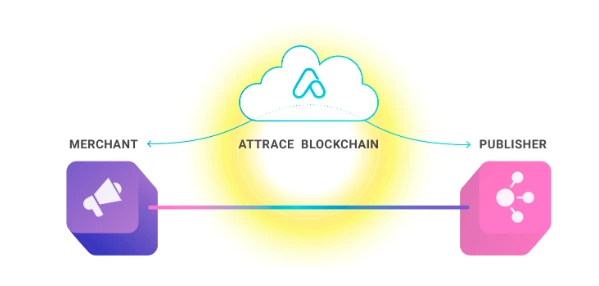
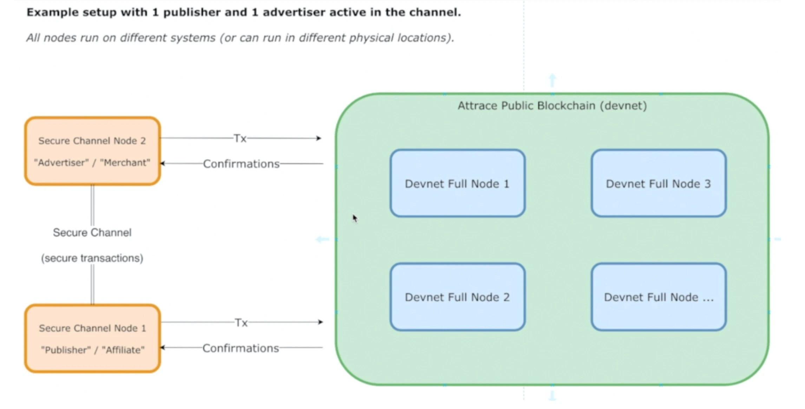

### Challenge

As a merchandiser, it is a challenge operating a business using the affiliate as a marketing method. SME finds it hard to have confidence for affiliate agencies due to its flimsy credibility and expensive entry cost. Those issues can be diagnosed as a 3T symptom: Trust - Tracking - Transparency.

They struggle to track the cash flow, unable to get the real report on the number of clicks per product, or how many of that turned into real purchases. This wall between merchants and publishers creates a loophole for fraud affiliate agencies to take advantage.

On top of that, affiliate marketing is very easy to engage in. This highlights the importance of the platform's approach to User Experience - precious customers converted might leave if they couldn't find what they seek for. Indicating that Attrace is facing both challenges at the same time.

> Attrace is a solution that removes the role of middleman, assure transparent information between parties while reduce the entry cost to absolute minimum.

### Solution

In it's simplest form, the solution is a mechanism that leverages blockchain network to track and store the agreement between parties through a [smart contract](https://en.wikipedia.org/wiki/Smart_contract) that linked to individual user interactions (eg. clicks).

By going with this route, the implemetation must be seamless and cause zero interuption in user experience, while still maintains the current currency in commission payment.

> Our unique approach requires no understanding in blockchain comprehension from users, under the form of a game-changer with groundbreaking value.

#### Technical diagnosis

Blockchain based system is hard to get right, and building it from scratch might be the most challenging work we ever face in terms of technology. Especially when it doesn't base on any of those convenient OSS Blockchain frameworks such as Hyperledger or Ethereum, and we have good reasons doing so.

Due to the facts that our approach was to log a transaction upon user interactions, using Ethereum would be a bummer since ETH's transaction performance is unacceptably slow while the cost for using an ETH chain is already far from reasonable.

> The backbone of blockchain is the elimination of middleman by a robust transaction records that ensure security and transparency.

The consensus protocol of blockchain generates an irrebuttable agreement for different devices on the same public blockchain network, as well as prevents the system from being exploited, and every node gets the same level of transparency. Meanwhile, these nodes remain private to make sure user data is secured confidentially.

Though we stepped in at the early stage of the blockchain hype train, having well-equipped knowledge of this technology, it took us great efforts of "trial and fail" along the way.

#### Implemetation

Attrace contains 3 main components

- Public Nodes: the Core Network
- Account Nodes: also known as Private Nodes
- [Attrace.com](https://attrace.com/): for user entry point, sales, marketing and customer service

**The Public Node** can be seen as the backbone of the network. It's the most challenging piece where all the PoS consensus, electing, producing and validating happens. The Dwarves spent a lot of time with Roel, the CTO, to draft the first version of consensus protocol design and build the very first blocks.

Gradually, we participated deeper than just the core network. We started to own our work in the **Account Node**. This node aims to store the user's private data and listen to the public blockchain. Not only to keep it synchronized with the public network, their privacy must be up to the highest level. Account node was made to prevent public producers from seeing user's data, complying with a GDPR standard for data privacy.

Lightweights are also a crucial factor. It usually takes end users up to 10 minutes to bootstrap their own Account Node before using Attrace. That's why we plan to have it simple and best minimize the bootstrapping time for the whole thing.

[Attrace.com](https://attrace.com/) is the environment where end-users set up their agreement based on their needs, without any specific template or any static required metrics. This requires a dynamic, backward compatible backend and a UI that can simplify complex functions into a click-based system to make this environment work flawlessly.

#### Tech stacks

| Back-end       | Golang               |
| -------------- | -------------------- |
| Front-end      | React                |
| Infrastructure | k8s, AWS, Prometheus |

#### Engagement

We initially deployed 1 Backend for Attrace while it was just a good idea. After the 1st month, we moved forward to shape the product; 2 more engineers were added to the team. It took the protocol 6 months to finish itself, giving us a significant understanding of the system, by involving in the early stage and actively contributed to the process.

> It's not about daily standups nor the process we follow, it's about having the same objective to work towards. More than the high quality work, it's a steady partnership where trust matters.

The process was standardized and agreed to keep everyone on the same page. We are confident that new people can jump in at any point in the project and still able to catch-up and aware of what's next to fill in the big picture. Aside from development, our Account Manager also actively build up the partnership and discuss directly with Attrace's CEO for any company-level plan.

### Outcome

The massive contribution rewards us with an MVP version after 9 months. The MVP rolled out with tons of positive feedback, approached by advertisers and publisher firms. This proved the product idea and enabled Attrace to take further steps in the development cycle.

The partnership gradually went south as they plan to build up a full team in Vietnam with high trust and expectation. Apart from a robust Backend crew, Attrace plans to build up their Front-end and Design in Vietnam to expand their team size, which means our prioritized backlog list is still a long way ahead.
