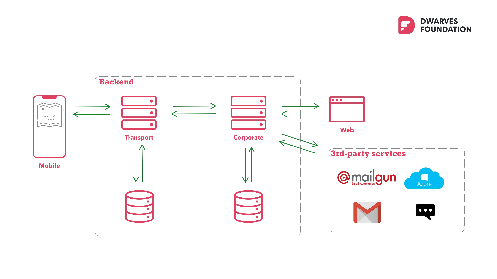
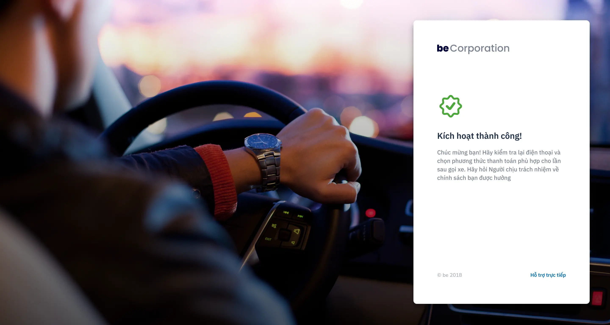

### Challenge

**beCorporate** is a vision of beGroup that tailored for enterprises to manage and optimize in-house business transports for employee. The product can be used as a ride-hailing service for employee to register, schedule and book vehicle for business transports via **beApp**, either as a group or as an individual.

At that time, **be** Engineering team was overwhelmed with the release of their ride-hailing app - **Be**, the initial launch gained a lot of traction and traffics which in turn drives the development team to their most busiest stage.

Meanwhile, their timeline to release **beCorporate** couldn't change due to planned business roadmap that is critical for the young startup to step into the game. Back in 2018, it was challenge to build an in-house team of experienced Golang developers while the local community was still small and young. Dwarves Foundation on the other hand was one of the first teams in Vietnam that leverage Golang as the strategic language to help startups and companies on their way to success.

The Dwarves stepped in with a team of 6 to take on the whole development stage of **beCorporate**, enlarging current 10 people team of **be** to a workforce of 16 people, working collaboratively to supercharge product development.

### Solution

With the clear target ahead, Dwarves quickly identify what is the end result should be by sketching up the ideal architecture of beCorp in two perspectives: as a stand-alone system and as a "service" within be's cloud ecosystem that integrates with their API gateway and monitoring infrastructure.

The stand alone architecture is necessary for Dwarves to propose our approach to modern enterprise solutions without compromising stability and reliable. On the other hand, the ecosystem architecture ensuring everyone to aware how would beCorp fit into the big picture of be's existing infrastructure. This allows the team know exactly what interfaces are needed to be implemented to comply with current system and various integrations.

Having the architecture confirmed, the Dwarves quickly develop a "dummy" version of beCorp (that follows Be's cloud interface) to verify the required integration between beCorp and various services inside Be's infrastructure. With everything in place and verified (logging, monitoring, crash reporting and automated CI pipeline) we begin development sprint with bi-weekly release iteration.

Beyond our Scrum sprint planning sessions with Be's team, Dwarves also propose about holding technical knowledge sharing sessions - which further improve our understanding about Be's corporate cloud and at the same time Dwarves could effectively debate the technical decisions we've planned to apply to BeCorp.

### Outcome

Moving forward, together with Be team, we managed to release the first MVP in the next 3 months. By offering competitive promotions, professional service quality backed by a solid tech-driven foundation and engineering culture, beCorporate is expected to become the strategic partner for enterprises - bringing a seamless, future-proof solution to business transportation.

The collaboration brought great impacts for our partnership. As a result beCorporate has made its way to the market and created significant achievements, which enables **be** to lay its name on the map of transportation industry in Vietnam.

Technical wise, engineering quality and seamless collaboration process are not the only things the Dwarves brought to the table. **be** were able to speed up their working pace and keep on improving it without being tied down. The augmentation allows **be** to cut off and reduce their recruitment and training cost, to fully invest in product development and maintaining current resources, marketing strategy and branding activities.

