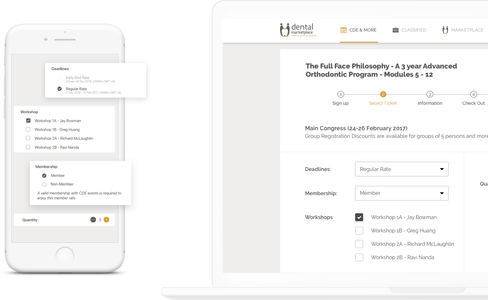
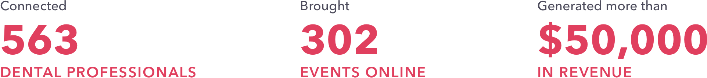

### Business context

In Singapore, a dentist must possess a license regulated by Singapore Dental Council (SDC) to practice dentistry and a license regulated by the Ministry of Health Singapore (MOH) to operate a dental clinic.

Extranet (Direct booking platform)

- The SDC retains control over all the laws governing CDE events. Therefore, workshops or Continuing Dental Education (CDE) events that run by organizations such as hospitals or institutes must strictly comply with SDC rules.

- Job and recruitment market is operating orally and solely posted by Singapore Dental Association (SDA) monthly in the Classified listings, which is a manual and slow procedure. Once a dental professional misses out for a chance, he has to wait for another month to get another hardcopy.

- Dental clinics are still making orders via phone or SMS with dental suppliers. Since there are no order tracking, order management and loyalty system, they find it hard to compare the quality and choose the most suitable one amongst many suppliers.

The market of Singapore dentistry is USD $24M a year generating by at least 688 clinics. These clinics are spending USD$2,064,000 a month on dental supplies. Despite the robust growth, the whole industry still operates things in a traditional way. Changing the long-term habits and optimizing the dentistry operations is really a challenge for [Dental Marketplace](https://www.dentalmarketplace.com/).

### The handshake

Desmond deeply understand the problems and market. Building a good MVP re-organizing the CDE events in 4 months is a way to penetrate the market. This MVP is a good test for the market feedbacks. The product must be UX/UI friendly and make sense to the dental professionals who are familiar with the hardcopies, papers, documents for years.

To make sure the MVP works well and results with good market penetration, Desmond is in need of a partner with expertise in building fault-tolerance and scalable software, experienced in product-fit design and provide cost-efficient solution for start-up founders.

We backed up by skillful engineers, with the top-notch knowledge in Golang to carry out a steady and scalable backend system. Strictly followed the Agile practices, Scrum framework to iterate the product release and adapt to changes, Dwarves Foundation comes across as exactly what Desmond is seeking for.

### Development

#### A. Solution

Desmond and the Dwarves conducted the first step of partnership by understanding the market background, the problem it’s facing and the upcoming vision. After deciding to build an MVP that focuses on CDE events and covers on iOS, Android and web platforms, the team identified the core features and modules then listed out critical points in the system core to prepare for the architecting phase. We know the main problem in UX/UI design in Dental Marketplace is how to make it user-friendly and easy to use to change the habits of dental professionals. They went to Design Thinking Methodology and applied Design Sprint to tackle the unknown problems.

<Link href="/work/dental-marketplace" className="underline">
  Find out more of their UI/UX design
</Link>

Dwarves Foundation sketched up the architecture of the system, user flows & diagrams before choosing the tech stack to continue the work. In order to optimize the event registration and transaction process, they picked out Golang as the primary language for backend system, then formed up a team of experienced engineers in ReactJS, Swift, Kotlin and QA working closely with Desmond and his product guy.

#### B. Techstack

| Technology | Use Case |
|------------|----------|
| Golang     | Backend API and processing of data-sensitive transactions for the Dental Marketplace |
| Swift      | iOS development with modern syntax, improves code cleanliness and reduces errors |
| Kotlin     | Android development, concise and fully interoperable with Java |
| VueJS      | Frontend development, lightweight and ideal for rapid prototyping with low learning curve |

#### C. Process

Desmond's office is 1 hour different from the Dwarves Foundation team so we setup an overlapping working hour with him

- We manage the tasks on Trello board to keep everyone updated

- Every Monday morning, the team gets into Slack call and Trello board to do planning for a new sprint. We make sure everyone understand the requirements and output expectation

- The team reviews the sprint work on Thursday weekly for testing

- The sprint release is scheduled on Friday morning for Desmond to align the product with his direction

- The team then has a quick retrospective to improve the work

### Outcome

The first version of the MVP was launched after 12 weeks of hard work. Dental Marketplace generated more than $50,000 in revenue, connected 563 dental professionals and 302 events were brought online.

Dental Marketplace was developed for responsiveness on various screen sizes, which enables its user to access from different types of device. The backend system is also well-craft for processing data-sensitive on payment transactions and ready-for microservices extendable. By coming to this stage, Desmond has solved his very first issue from day one: Build a playground for dental professionals, connect them by a mutual understanding and address them with different needs.

