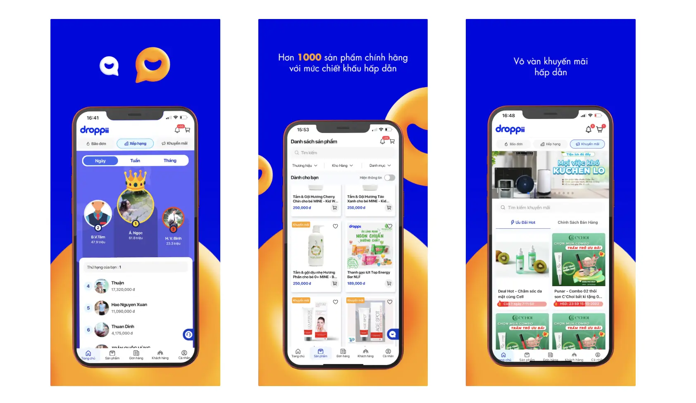

### Challenge

Droppii needed to update their platform to keep up with the changing e-commerce industry and support their growing business. Their existing system, which was quickly built during their early "90 Days Rushing" phase, couldn't handle their new needs anymore.

While Droppii's team was strong in backend development and handling business data, they needed help with creating a better user interface and expanding their development team. They were looking for a partner who could both build great technology and manage the project efficiently.

We started by taking a close look at Droppii's existing systems, how they managed their product, and their workflow. This helped us create a plan for building a user-friendly, scalable platform that would serve their business needs better.

### Solution

Droppii and our team worked together in two main phases to rebuild their platform:

In the first phase, our developers worked closely with Droppii's team to quickly build and launch Droppii for Business v3. This new version worked smoothly across web, iOS, and Android platforms, with an easy-to-use interface that made sense for their business users.

For the second phase, we focused on adding more advanced features. We built a new dashboard that gave users better visibility into their business, a content management system that made updating information easier, and upgraded their business management tools. We also kept improving the design to make everything more intuitive. To ensure everything worked properly, we set up automated testing that integrated smoothly with Droppii's existing systems.

### Outcome

Our partnership with Droppii produced great results. Business users responded positively to the new Droppii for Business v3 platform. The improved business tools and data management features gave businesses better control over their operations and more useful insights.

This project did more than just improve Droppii's technology – it strengthened their position in the e-commerce market. Our technical expertise and flexible approach to development played a key role in this transformation, helping Droppii adapt and grow in the fast-changing world of online commerce.

### Impact

Working together, we showed how combining technical skills with strategic planning can dramatically improve a business's online platform. By focusing on creating an excellent user experience and efficient operations, we not only improved how Droppii works today but also built a foundation for their continued growth and innovation.
