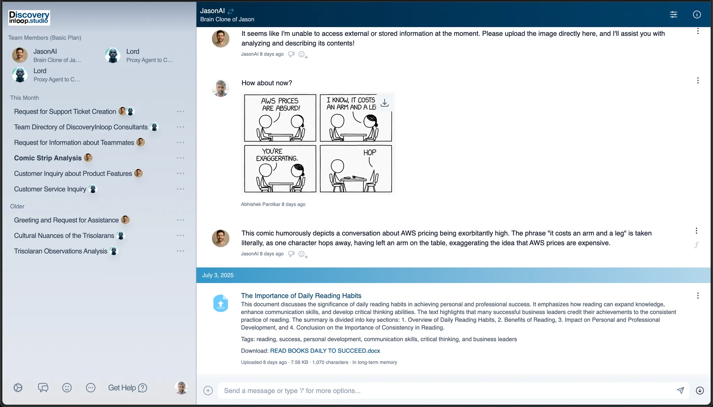
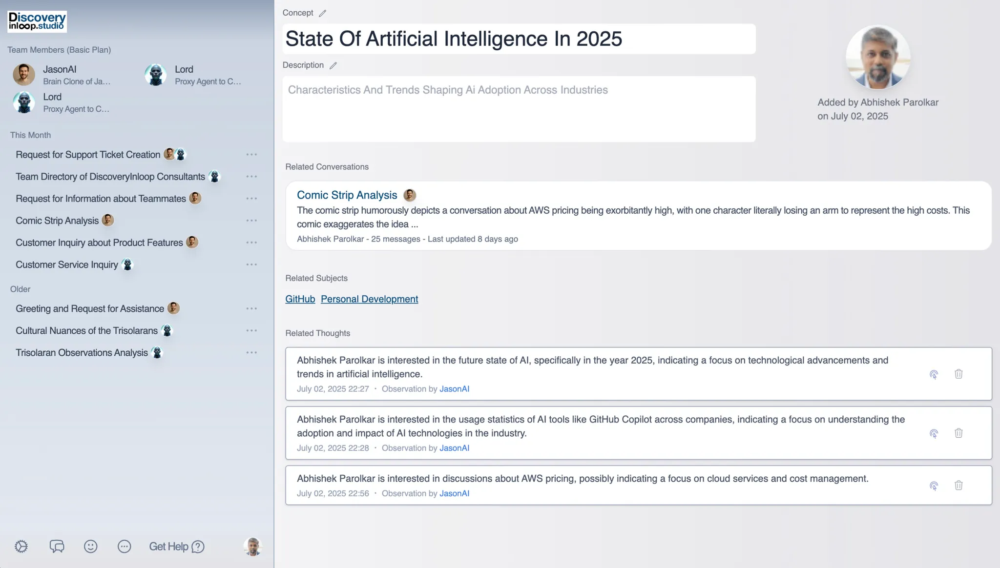

### Challenge

Legacy consulting engagements face widespread issues: they are **slow, opaque, and often fail to produce actionable results.** Teams struggle with internal misalignment, vague objectives, and analysis paralysis. Discovery Inloop addresses these pain points through key innovations:

- **Speed vs. depth:** Compress discovery cycles into one week without sacrificing quality
- **Human-AI balance:** Balance facilitator autonomy with AI augmentation
- **Trust and engagement:** Build workflows that foster trust from day one
- **Security and confidentiality:** Ensure data security throughout the process
- **Facilitator onboarding:** Enable rapid onboarding across diverse domains
- **Scalable methodology:** Support wide spectrum of domains without losing consistency

### Solution

Discovery Inloop represents a strategic evolution of conversational AI technology for enterprise consulting applications. Built on proven AI chat architecture, the platform extends foundational capabilities with enterprise-grade security and organizational frameworks.

Working with the core team's technical leadership, our developers contributed to adapting existing conversational AI infrastructure to meet the demands of consulting facilitation. The goal was to create a secure, structured platform that could support professional engagements while maintaining intuitive interaction patterns.

> Key Innovation: Implementation of a comprehensive clone and template system that allows facilitators to replicate successful engagement patterns while ensuring each interaction maintains cryptographic integrity.

The platform provides consulting professionals with enterprise-grade AI tools, establishing a foundation for secure, structured AI-assisted consulting engagements.

### Technical highlights

| Area                        | Details                                                                                |
|---------------------------- | -------------------------------------------------------------------------------------- |
| Backend                     | Ruby on Rails with PostgreSQL, building on proven conversational AI architecture.      |
| Security framework          | User action provenance with fingerprint confidence scoring                             |
| Contract integrity          | Tamper-proof contract system with cryptographic verification                           |
| Organizational structure    | Hierarchical framework supporting facilitators → inloops → engagements → conversations |
| Enhanced clone capabilities | Advanced conversation replication and template functionality                           |
| Enterprise adaptation       | Professional-grade adaptation of conversational AI for consulting use cases            |

### How we built it

Development focused on **extending proven conversational AI capabilities** for enterprise consulting and implementing robust security frameworks. The approach built upon existing chat infrastructure while adding organizational structure and security features required for consulting applications.

#### Enhanced clone architecture

The success built upon **existing conversational AI clone capabilities**, significantly enhanced for professional consulting. The core cloning functionality was extended to support structured templates, engagement patterns, and facilitator methodologies while maintaining the intuitive interaction model.

#### Enterprise security framework

To meet professional consulting requirements, a comprehensive **security layer** was implemented featuring user action provenance tracking. This captures detailed behavioral patterns during contract signing and engagement interactions, generating **fingerprint confidence scores** that verify user identity and intent with cryptographic integrity.

#### Organizational hierarchy

Building on existing conversation infrastructure, a **structured organizational framework** was created supporting the consulting workflow. This hierarchy allows facilitators to manage multiple engagements while maintaining clear boundaries and security controls.

#### Tamper-proof contract system
Recognizing the need for verifiable agreements in consulting contexts, **tamper-proof contract capabilities** were developed that bind both facilitators and engagements with cryptographic verification. The system tracks detailed behavioral patterns during contract signing, providing mathematical verification of signatory identity and intent.

#### Technical approach

- **Conversational AI foundation:** Built upon **proven chat infrastructure** with enhanced capabilities
- **Advanced clone system:** Extended existing functionality to support **consulting templates and patterns**
- **Cryptographic security:** Implemented **fingerprint verification and device binding** for enterprise-grade security
- **Organizational structure:** Created hierarchical framework supporting consulting workflow
- **Contract integrity:** Developed **tamper-proof contract system** ensuring accountability
- **Enterprise adaptation:** Professional-grade enhancement specifically designed for consulting applications

#### Lean development process

To deliver the platform efficiently:

- **Core team collaboration:** Direct partnership with lead facilitators and domain experts
- **Rapid iteration:** Daily standups and async feedback loops accelerated decision-making
- **Real-time refinement:** Feedback incorporated immediately to fine-tune workflows
- **Unified approach:** Technical and product teams operated as one unit

### How we collaborated
Our developers worked closely with the **core team's technical leadership** and consulting professionals to adapt proven conversational AI technology for enterprise consulting applications. The collaboration brought together engineers experienced in conversational AI platforms, expertise in enterprise security frameworks, and consulting methodology specialists.

Since the project involved adapting existing technology for a new use case, development focused intensively on understanding consulting workflows and security requirements through:

- **Technical advisory sessions** to leverage existing platform capabilities
- **Security framework development** to meet enterprise consulting standards
- **Consulting workflow analysis** to design the organizational structure
- **Clone system enhancement** to support professional templates

This approach enabled effective collaboration between proven AI technology foundations and new enterprise consulting requirements.

### Outcome

The project successfully delivered an **enterprise-grade conversational AI platform** specifically adapted for professional consulting. Key achievements include:

- **Enhanced clone functionality** supporting structured consulting templates
- **Enterprise security framework** featuring fingerprint verification and non-repudiation capabilities
- **Organizational hierarchy** enabling facilitators to manage multiple engagements
- **Tamper-proof contract system** ensuring cryptographic integrity
- **Professional platform adaptation** transforming conversational AI for enterprise consulting

The collaboration provided the consulting technology space with key advantages:

- **Secure consulting platform:** Enterprise-grade security meets professional consulting requirements
- **Structured engagement management:** Clear organizational hierarchy supports complex workflows
- **Replicable consulting patterns:** Enhanced clone capabilities enable template leverage
- **Cryptographic accountability:** Tamper-proof contracts ensure trust throughout relationships

> Impact Statement: "By extending proven conversational AI capabilities with enterprise security and organizational structure, a foundation was created for secure, structured AI-assisted consulting that maintains intuitive interaction patterns while meeting professional standards."

The platform establishes a foundation for AI-assisted consulting, built on proven conversational technology while meeting the specific security and organizational requirements of professional services.