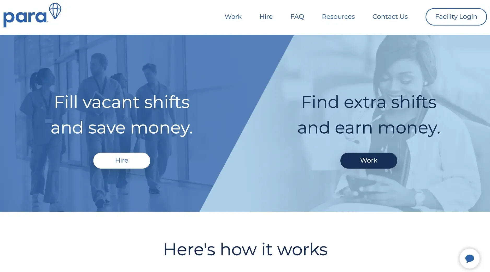
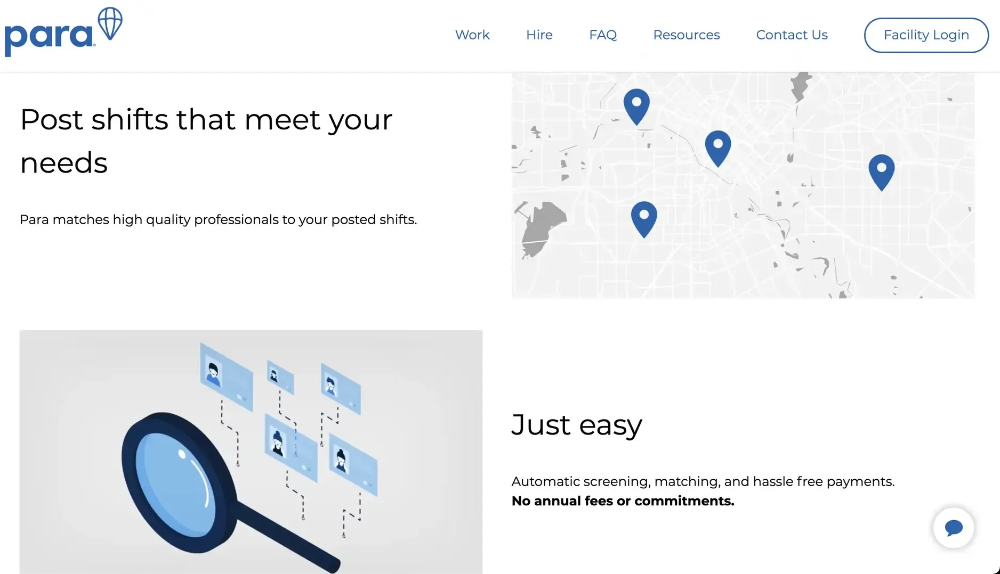
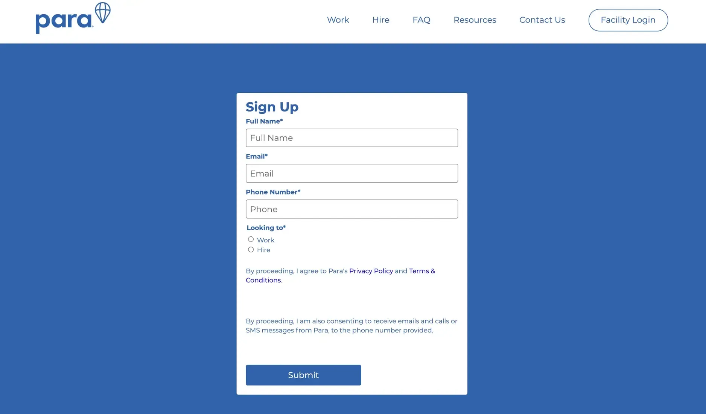

### What we did

After establishing the initial concept, Para needed to move fast from idea to working product. Our team stepped in to accelerate their MVP development, taking over key technical responsibilities so the founders could focus on go-to-market efforts and user outreach.

We focused on building core features such as credential validation, real-time shift matching, and secure messaging between nurses and hospitals. Working under tight timelines and high urgency, we ensured the platform was stable, scalable, and ready to serve during a nationwide healthcare crisis.

By collaborating closely with Para's team, we helped them launch on time and meet the critical staffing demands hospitals faced at the height of the pandemic.

### Challenge

Hospitals have always struggled with staffing challenges, but COVID-19 made the situation critical. Medical professionals were in high demand, and traditional staffing methods were too slow for the rapidly changing needs of healthcare facilities.

The pandemic created unprecedented pressures on the healthcare system:

- Hospitals experienced sudden surges in patient numbers
- Staff members were becoming ill and unable to work
- Burnout increased as healthcare workers faced overwhelming conditions
- Traditional staffing agencies couldn't respond quickly enough
- Qualified nurses were available but lacked efficient ways to find shifts

Para saw a clear opportunity to help by creating a direct connection between qualified nurses and the hospitals that needed them most urgently. Their platform would eliminate the middleman, speed up the matching process, and help address the staffing crisis at a crucial time.

This is where we came in. Para needed a team that could quickly build reliable software to handle complex workflows and large volumes of data. Speed was essential - the sooner they could launch, the more help they could provide during the crisis.

### Technical highlights

| Area           | Detail                                                                  |
|----------------|-------------------------------------------------------------------------|
| Backend        | Go microservices architecture for reliability and performance           |
| Frontend       | React with Redux and Material UI for consistent interfaces              |
| Mobile         | Cross-platform development for iOS and Android                          |
| Database       | MySQL optimized with raw SQL queries for better efficiency              |
| Infrastructure | Google Kubernetes Engine (GKE) for scalable deployment                  |
| Messaging      | RabbitMQ for handling asynchronous processing                           |

### How we built it

We took a practical, focused approach to help Para launch quickly while building a foundation that could scale with their growth:

#### Technical approach

**Microservices architecture**: We built a system in Go that provided both reliability and performance. This architecture:

- Separated different business functions into independent services
- Allowed for targeted scaling of high-demand components
- Improved fault isolation to maintain overall system stability
- Enabled faster feature development in parallel

**Message-oriented middleware**: We implemented RabbitMQ to handle asynchronous processing, which:

- Managed background tasks without affecting user experience
- Enabled reliable communication between services
- Provided a buffer during traffic spikes
- Ensured important operations weren't lost if a service went down

**Optimized database performance**: We wrote raw SQL queries instead of using ORM (Object-Relational Mapping) to gain:

- Better control over query execution
- Improved performance for complex data operations
- More efficient use of database resources
- Reduced latency for critical operations

**Cloud-native deployment**: Using Kubernetes on Google Cloud (GKE) gave us:

- Automatic scaling to handle variable load
- Self-healing capabilities to recover from failures
- Consistent deployment across environments
- Better resource utilization

**Advanced matching algorithm**: We created a sophisticated system to match healthcare workers with shifts based on multiple criteria:

- Credentials and specializations
- Location and travel preferences
- Availability and scheduling constraints
- Facility requirements
- Previous experience and ratings

**Comprehensive quality assurance**: We implemented automated regression testing and used Codecov to ensure complete test coverage, maintaining reliability even with rapid development.

#### How we collaborated

We assembled a flexible team structure that evolved with the project's needs:

**Initial phase**: A senior backend engineer worked closely with Para's team to build the core system and implement the complex business logic that powered the matching service.

**Design phase**: As the backend foundation took shape, our design director and UI designer joined to improve the mobile app interface. They created designs in Figma and Sketch that worked effectively on both iOS and Android.

**Frontend implementation**: Next, a frontend engineer turned those designs into functional interfaces using React, ensuring a consistent user experience across platforms.

**Project oversight**: Throughout the project, our project manager provided coordination and business guidance, helping align our technical work with Para's goals.

This team of five maintained close communication with Para's leadership, adapting to changing requirements while keeping development on track for a timely launch.

Our communication approach emphasized clarity and efficiency:

- Slack and Google Meet for daily team discussions
- Figma for collaborative design work
- Git with proper Gitflow practices for code management
- Jira, Statushero, and Confluence for comprehensive task tracking

This communication structure helped us maintain alignment with Para despite the challenging circumstances of the pandemic and remote work.

### What we achieved

After six months of focused development, we helped Para launch their MVP on schedule - a fully functional app for managing nurse shift schedules. The platform successfully connected healthcare facilities with qualified nursing professionals at a time when this service was critically needed.

The key achievements included:

**Functional MVP launch**: We delivered a complete, polished application that was ready for client demonstrations and initial user onboarding.

**Reduced development timeline**: Our expertise helped Para significantly accelerate their development process, bringing their solution to market months earlier than would otherwise have been possible.

**Critical pandemic support**: By connecting nursing professionals with vacant hospital shifts, Para made a meaningful contribution to the COVID-19 response.

**Foundation for growth**: The architecture we built provided Para with a solid technical foundation that could scale as their business grew.

The platform included several key features that set it apart from traditional staffing solutions:

- Streamlined verification process for healthcare credentials
- Real-time shift matching based on qualifications and availability
- Direct communication between facilities and professionals
- Simplified scheduling and shift management
- Secure handling of sensitive healthcare information

Para's CEO expressed their satisfaction with our partnership: "Dwarves Foundation's communication skills are exceptional as well as their integrity. They stand out with the highest standards of delivery. Dwarves is in a league of their own."

Our work with Para demonstrates how technical expertise can be applied to address urgent social needs. By helping Para launch quickly during a critical time, we contributed to addressing healthcare staffing shortages when they mattered most, while also setting Para up for long-term success in transforming the healthcare staffing industry.
