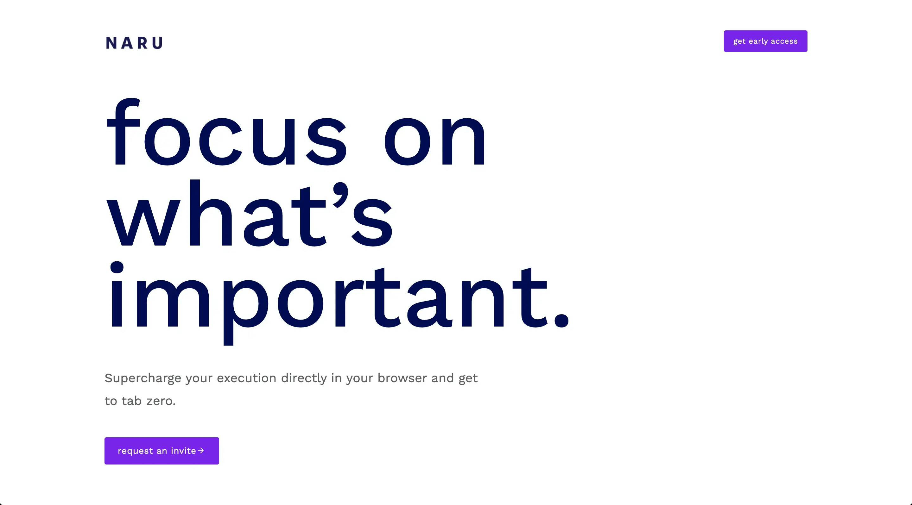
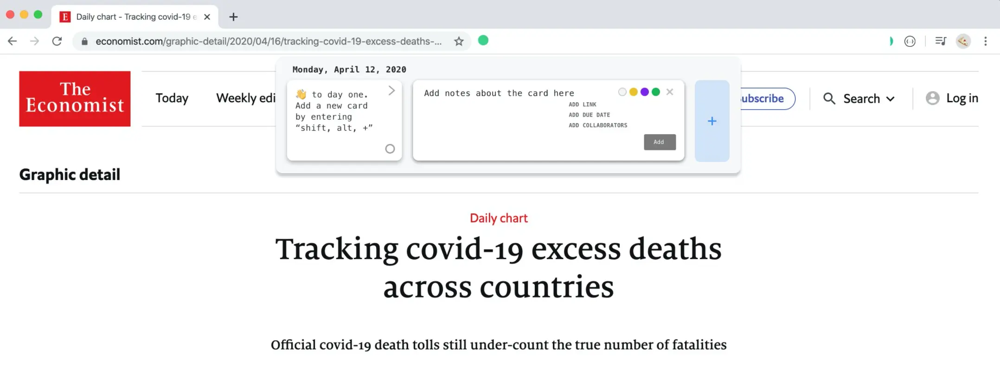
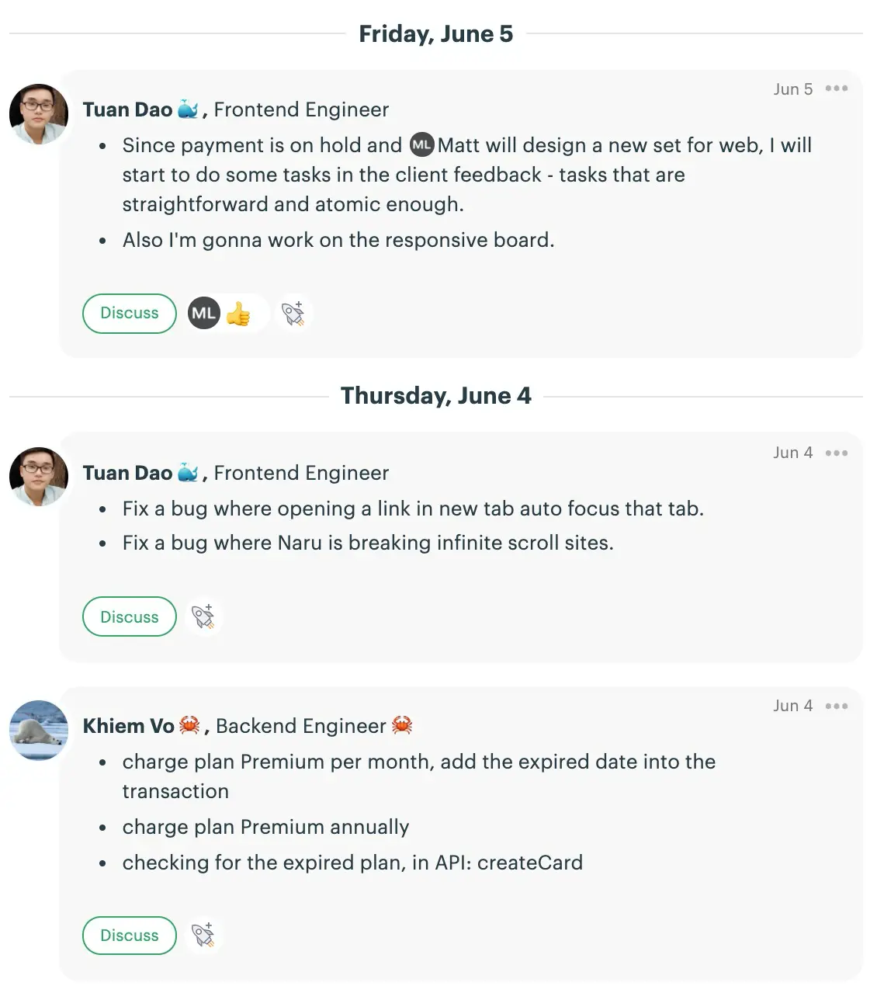
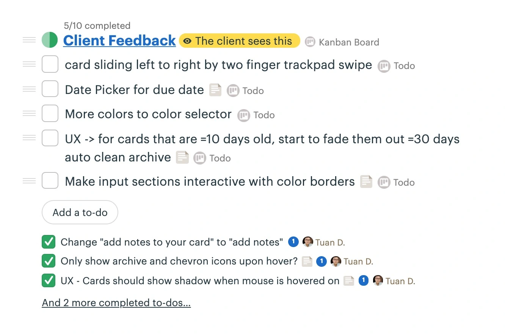
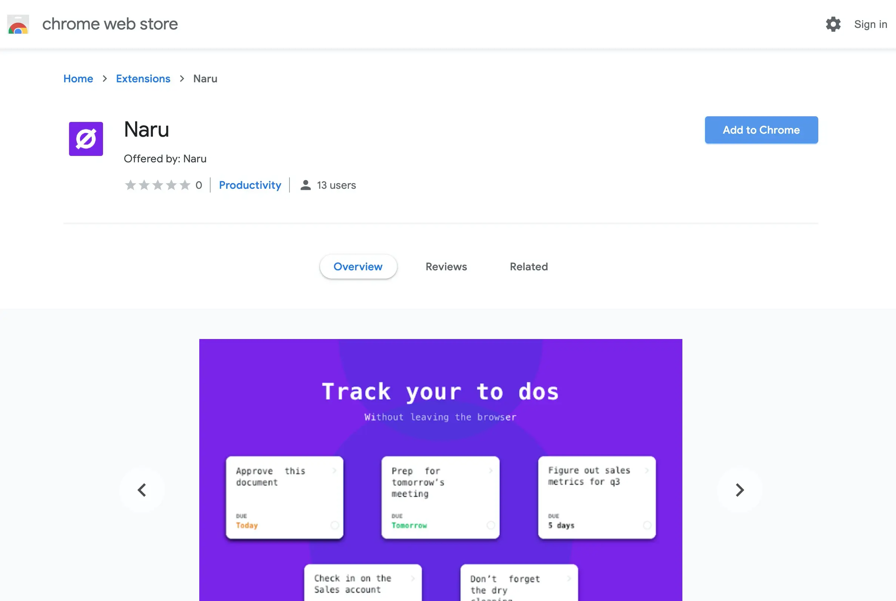
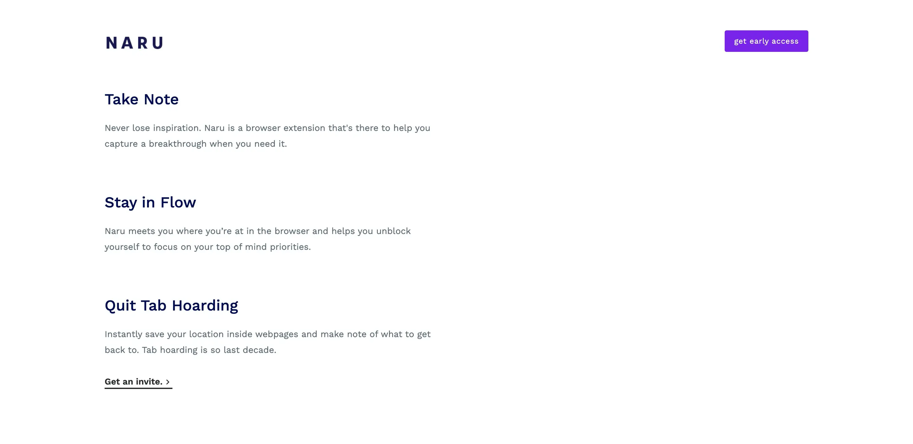

Naru's goal is to supercharge user workflows on web browsers - take note, stay in the flow, and quit tab hoarding forever.

The free tier allow user to freely create up to 24 cards on his/her board, after that there is a "premium" plan for unlimited cards plus unlocks color tagging and filtering features.

### Challenge

Making a web extension behaves like an application (says Trello) is nontrivial - a web extension work by attaching (and then execute) its own `<script>` tag to the current web page, after execution the extension boot up with a UI for user to start interacting. As such, the extension only "live" in the current page (or browser tab) - opening new web page means loading a new extension. Thus ensuring the "task board" keeping its open "state" across tabs is critical and is the highest priority development goal.

### Collaboration

To begin with, Matt resides in the U.S which is roughly 11 hours away from us (Indochina Time). For instance, Matt had to stay up at 9pm while the team had to wake up at 8am for our daily catchup meeting. We quickly realize such schedule won't work in the long run. After 2 sprints, we proposed "async" communication - daily calls became daily check-in writeup along with 3 quick calls (15mins each) per sprint: sprint planning, mid-sprint adjustment and sprint retrospective. Make everyone to write their daily check-in force us to really think about what's really important in a day - help us avoid noise of unnecessary ideas during chit-chat and stay on the right track.

Moving forward, Matt started to add up more product ideas & features, varied from payment plans, team collaboration and analytics. Obviously the ideas are unorganized thus the team decided to create 2 dedicated todo "list": "Icebox" and "Client feedback" for Matt to comfortably add in his ideas. The team then have a schedule of twice a week to go through the lists, modify each item to structured software requirements, and propose back to Matt for clarification. Once approved those requirements became new features that we could either put to future sprints or to the backlog.

The workflow went quite well because it requires us to properly decide what's important based on current timeline, roadmap and release plan. Thus avoid quickly jump into implementation of unnecessary features that could lead us to the dead end.

### Release strategy

We wrap-up a prerelease (sideload version) every Monday morning, which is Matt's Sunday night - leaving him a week ahead to test the release. For official web store releases, we first wrap-up a prerelease a week before (and freezing all features at the same time) and spend the next sprint only to test the prerelease to ensure it is stable before uploading to the web store.

### Conclusion

After 3 months, the very first stable version of [Naru.app](https://naru.app/) hit the web store - indicating our very first success in the collaboration with Matt as well as web extension development. Moving forward, we have a bunch of advanced features in the backlog such as team collaboration, team space and activity dashboard - It's going to be a busy and an exciting year.

