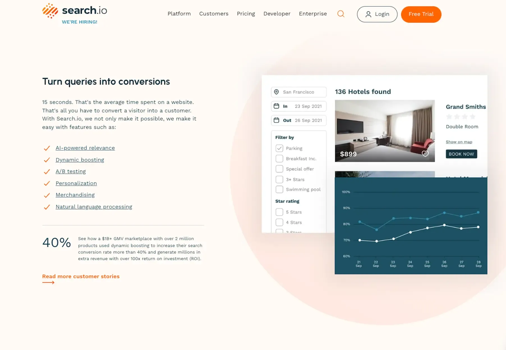

### Challenge 

Search.io's platform helps businesses perform better by providing advanced online discovery services. Their technology needs to understand what users are looking for (like a human would) while still being fast and available through easy-to-use interfaces.

The company wanted to make sure customers had a great experience no matter how they used the search tools - whether through Search.io's own dashboard or when integrated into other platforms. This meant creating developer-friendly tools and consistent interfaces across different systems.

They faced several technical challenges:

1. **Different user needs**: Their platform serves both business users managing search settings and developers integrating search into websites
2. **Multiple integration points**: The search functionality needed to work across various platforms and e-commerce systems
3. **Complex technology**: Their advanced AI search algorithms needed simple interfaces that non-technical users could understand

These challenges were particularly important as Search.io was looking to expand their market reach and compete with larger search providers.

### Technical highlights

| Area                | Technology/Approach                                |
|---------------------|--------------------------------------------------- |
| Frontend            | React.js with TypeScript for reliable interfaces   |
| State management    | Redux for complex application state                |
| Component library   | Custom UI components for consistency               |
| Documentation       | Docusaurus for comprehensive developer guides      |
| Testing             | Extensive unit and integration tests               |
| Integration         | Custom plugins for various e-commerce platforms    |

### How we built it

Our work with Search.io covered three key areas, each requiring a different approach to solve specific problems.

#### Technical approach

**Console Dashboard Improvements**: We enhanced the main control panel that businesses use to manage their search experiences. We focused on:

- Creating intuitive interfaces for configuring complex search algorithms
- Building visualization tools to help users understand search performance
- Streamlining workflows for common tasks like adding synonyms and adjusting relevance
- Implementing responsive designs that work well on different devices

**React SDK Development**: What began as a specific integration for Shopify evolved into Search.io's most important open-source offering. For this SDK, we:

- Built a flexible library that developers could easily customize for their needs
- Created comprehensive documentation with clear examples
- Designed a modular architecture that supports different UI frameworks
- Implemented automated testing to ensure reliability

**Platform Integrations**: We developed plugins for various e-commerce platforms, making it easier for stores to implement Search.io's technology. These integrations:

- Provided simple installation processes for non-technical users
- Maintained consistent functionality across different platforms
- Included customization options for advanced users
- Supported automatic updates to keep the search experience current

For the technical implementation, we used React.js with TypeScript to build reliable user interfaces. We implemented Redux for managing complex application state and developed a reusable component library to ensure consistency across all products.

Our emphasis on quality included creating comprehensive developer guides using Docusaurus and implementing extensive unit and integration tests to ensure reliability.

#### How we collaborated

We established a collaborative process that worked well with Search.io's distributed team:

- Regular video calls to discuss priorities and review progress
- Shared design documents and specifications in Figma
- Code reviews through GitHub pull requests
- Slack channels for quick communication and problem-solving
- Joint testing sessions to identify and address issues

Throughout the project, we maintained close communication with Search.io's team, adapting our work to fit their evolving needs and ensuring that all deliverables met their high-quality standards.

### What we achieved

Our work with Search.io resulted in several important improvements that helped strengthen their position in the market:

- **Enhanced dashboard**: A more powerful and user-friendly console that gives businesses better control over their search experiences
- **Improved developer tools**: SDKs and libraries that make it easier for developers to integrate Search.io's technology
- **New integration options**: Support for additional e-commerce platforms, expanding Search.io's market reach

The Shopify integration we developed helped Search.io connect with one of the largest e-commerce platforms, opening up a significant new market segment. Meanwhile, the search widget we created offered an easy solution for websites with limited development resources.

A Product Manager at Search.io noted: "Working with the Dwarves team has been a game-changer for us. They not only understood our technical needs but also grasped the business impact of what we're building. Their focus on quality and attention to detail helped us deliver a more powerful platform to our customers."

Our partnership enabled Search.io to enhance their offerings and provide a more robust search platform that delivers real-time results and has become trusted by large businesses worldwide. The improvements we made helped establish Search.io as a leader in AI-powered search technology, giving them a strong foundation for continued growth.

By focusing on quality and user experience rather than just adding features, we helped Search.io create solutions that truly improved their customers' businesses and strengthened their competitive position in the market.
