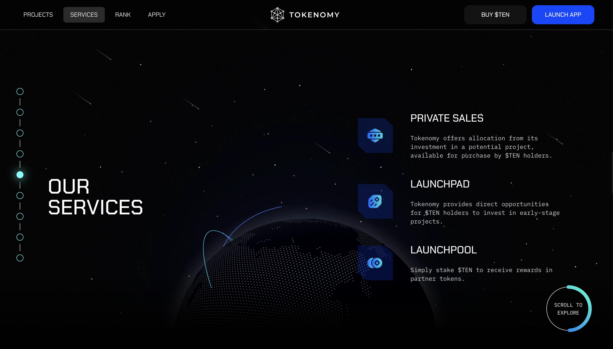
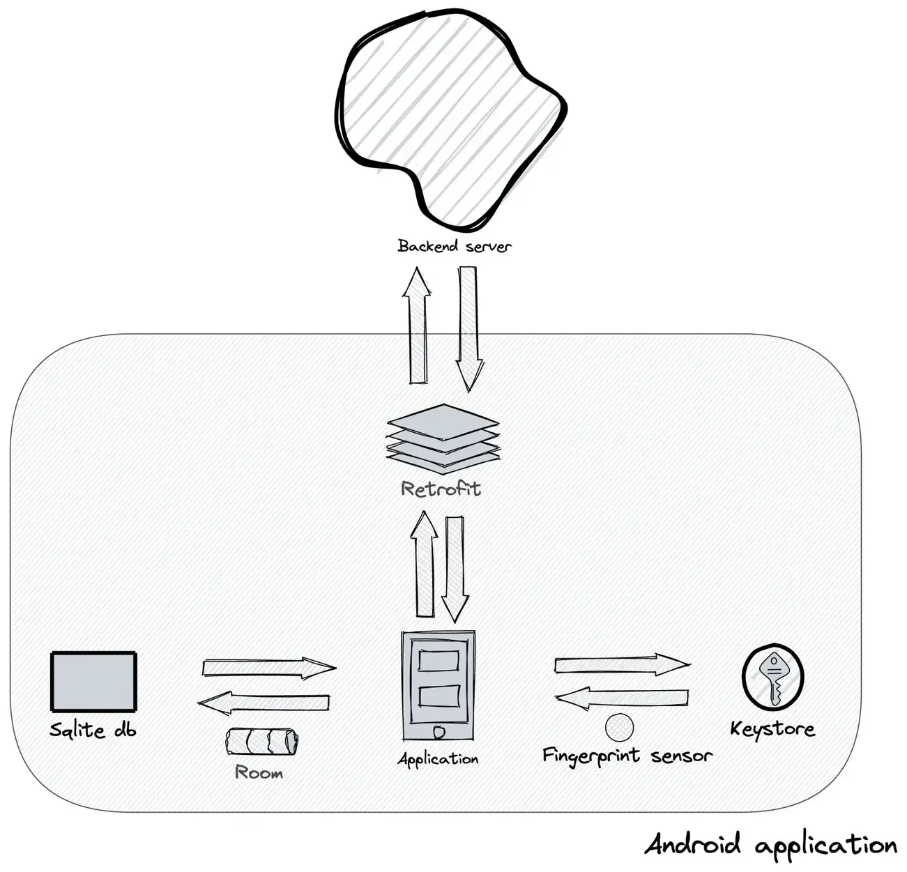
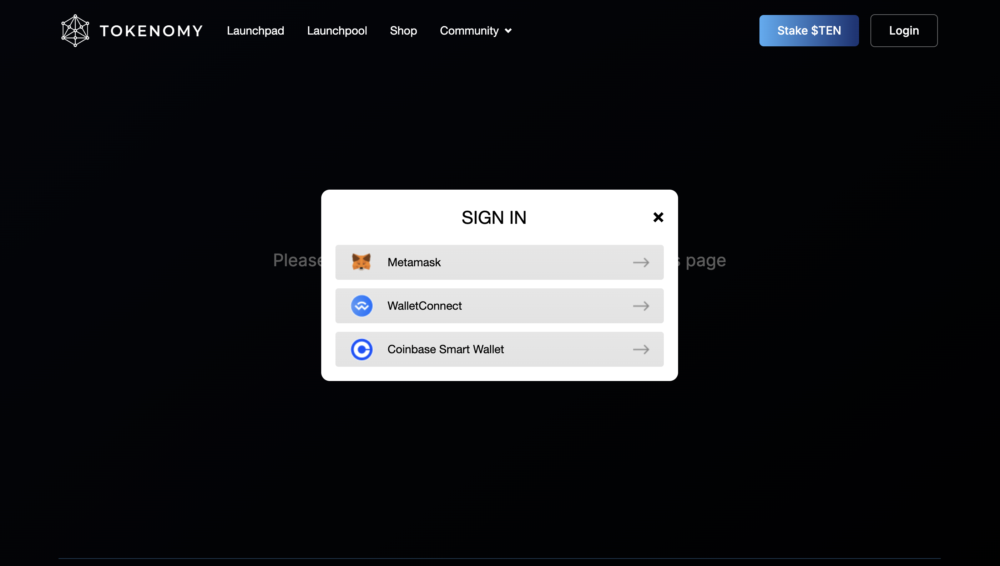

### Challenge

Tokenomy needed to reach a wider audience but had technical limitations in their existing platform. They faced several specific challenges:

- Creating a robust frontend that could support complex trading features
- Developing an Android app that maintained the same functionality as the web version
- Implementing a new design system across all platforms
- Meeting an ambitious launch timeline while maintaining quality
- Optimizing their backend APIs to support the expanding platform

These challenges were especially important in the competitive cryptocurrency market, where user experience can make or break a platform's success.

This project marked our first major venture into the blockchain industry. With a team of four developers, we worked alongside Tokenomy to ensure development moved at the pace their business required.

### Technical highlights

| Area           | Details                                                              |
| -------------- | -------------------------------------------------------------------- |
| Backend        | Elixir, Phoenix for scalable API services                            |
| Frontend       | React, TailwindCSS, Redux for web interface                          |
| Mobile         | Kotlin with MVVM architecture, ReactiveX                             |
| Database/API   | PostgreSQL, RESTful API, WebSocket integration for real-time trading |
| Security       | Biometric login, encrypted local storage (Android keystore)          |
| Infrastructure | Google Cloud Platform                                                |
| Dev workflow   | Slack, Jira, Figma, weekly changelogs for transparency               |

### How we built it

This was our first Android project for a cryptocurrency trading platform, giving our team valuable experience in a fast-growing industry.

#### Technical approach

We took a comprehensive approach to solving Tokenomy's challenges:

**Premium web application**: We built a completely new web app from scratch using React and TailwindCSS. This gave us the freedom to implement a modern design while ensuring the platform could handle complex trading features.

**Native Android app**: We developed the mobile app using Kotlin and following the MVVM (Model-View-ViewModel) architecture pattern. This approach separated the user interface from the business logic, making the code more maintainable and testable.

**Real-time trading**: We implemented WebSocket connections to provide instant market updates, which are crucial for traders who need to make quick decisions based on current prices.

**Security features**: We added biometric authentication and secure data encryption to protect users' sensitive financial information.

**Multiple API version support**: We created custom Android modules that could work with different API versions, giving Tokenomy flexibility as they evolved their backend services.

The mobile app included several features crucial for crypto traders:

- Dark and light theme options for different trading environments
- Efficient data caching to improve performance
- Automatic retrying of failed API calls to maintain reliability
- Fingerprint-secured password storage in the device's keystore
- Memory leak prevention to ensure stable performance over time

We carefully reviewed every UI element and user flow before implementation, which allowed us to provide valuable feedback to Tokenomy's product team. Weekly changelogs kept everyone informed about progress and next steps.

#### How we collaborated

We established clear communication channels with the Tokenomy team:

- Slack for daily team discussions
- Pivotal Tracker/Jira for managing tasks and tracking progress
- Google Hangout for regular team meetings
- Sketch and Figma for sharing and collaborating on designs

This communication structure ensured everyone stayed aligned throughout the development process, even when working remotely.

### What we achieved

Despite the challenges of implementing complex business logic and making numerous UI adjustments, we delivered a robust mobile app with an intuitive, modern interface that met Tokenomy's timeline.

The solid frontend foundation we built made it easier for Tokenomy to add new features as their business grew. The dark/light theme options improved the user experience for traders who often work in different lighting conditions.

Most importantly, the product launched according to the original roadmap, allowing Tokenomy to expand their user base and establish themselves as a serious player in the cryptocurrency investment space.

Our work helped Tokenomy create a platform that could compete with larger exchanges while maintaining their unique focus on blockchain-enabled tokens. The technical foundation we established continues to support their growth as they add new features and enter new markets.
